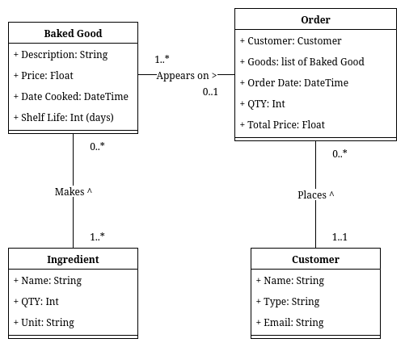

# Tutorial 1a

## Classes + Attributes

- Baked Good
  - description: string
  - price: float
  - date cooked: datetime
  - shelf life: int (days)
- Customer
  - name: string
  - type: string (wholesale, small business, distributor, individual)
  - email: string
- Order
  - customer: Customer
  - goods: list of Baked Good
  - order date: datetime
  - qty: int
  - total price: float
- Ingredient
  - name: string
  - qty in stock: float
  - unit: string (kg, g, L, mL)

## Basic Class Diagram (no methods)

