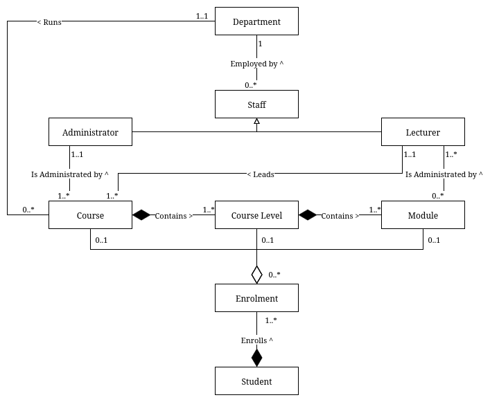

# Tutorial 2b

## Introduction and problem statement

### Question

Using your knowledge of the new relationship types (i.e. aggregation, composition, inheritance) covered in
this week’s lecture, update your university class diagram from last week’s tutorial using the following
problem statement (same as last week):

**University Case Study**

Each University department can have a number of Courses. Each course will have one or more course levels
(years of the course). A course level will only belong to one course.

A course level can have a number of modules but that module can only belong to one course level.

New students are enrolled onto their course, they are enrolled onto the level of the course and they are also
enrolled onto each module they will be studying at that course level. Returning students are enrolled onto
the level of the course they are studying and the modules they are studying at that course level.

Lecturers are assigned as module tutors. Usually there are 2 lecturers assigned to a module, but some
modules only have 1 lecture assigned while others have more than 2 assigned. They are responsible for the
administration of the module. (We are ignoring timetabling for this case study as it is an extremely complex
system).

Each department retains some information on the staff employed in that department. Staff are either
lecturers or administrators (For simplicity, ignore line management responsibilities here). An administrator
is responsible for one or more courses but a course is the responsibility of only one administrator. Lecturers
are also assigned as course leaders. A lecturer can be responsible for more than one course but a course is
the responsibility of only one lecturer.

---

- Do not include attributes or operations.
- With OO system design principles in mind, in addition to association, can you think of any other relevant class relationships that could be included? For example, is there any scope for showing inheritance – (i.e. generalisation/specialisation – superclasses/subclasses), aggregation, and/or composition?
- State any assumptions made.

### Answer

#### Version 1

^ This diagram is trash. 
  Note: Do not make class diagrams late on a Sunday night. It is not good for you.

#### Version 2

^ This diagram is better. 
  Note: Still do not make class diagrams late on a Sunday night. It is not good for you.
