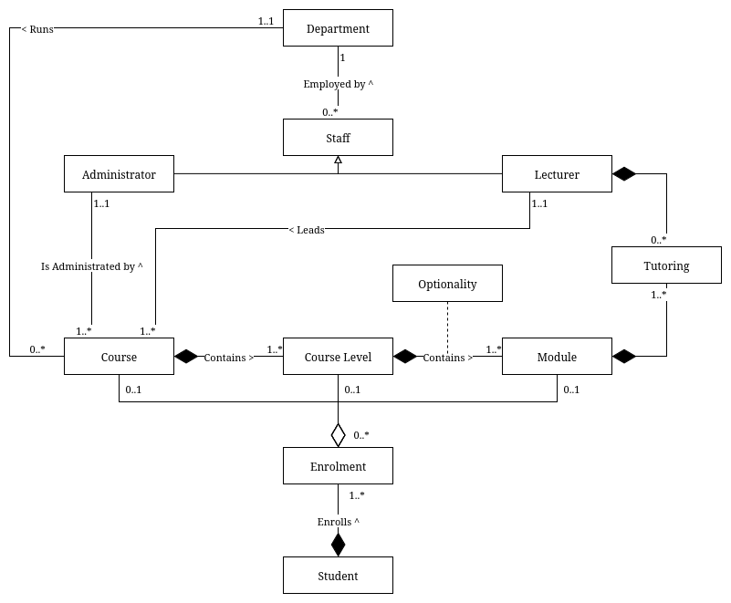

# Tutorial 3

## Introduction and problem statement

### Question

The purpose of this tutorial is to continue the development of the university case study model (Tutorial 2b)
based on the material covered in Class Diagrams Session 3. Update your previous university case study
diagram to include potential new association classes/full classes to hold attributes of any relationships.
You might also consider if any classes can be modelled as abstract classes. New details are in bold.

**University Case Study**

Each course will have one or more course levels (years of the course). A course level will only belong to one
course.

A course level can have a number of modules but that module can only belong to one course level.

New students are enrolled onto their course, they are enrolled onto the level of the course and they are also
enrolled onto each module they will be studying at that course level. Returning students are enrolled onto
the level of the course they are studying and the modules they are studying at that course level.

**Many courses have both core and optional modules. A core module must be studied by students at that level on that course. Optional modules are, as the name suggests, optional. Students must choose x number of modules from a list of y optional modules.**

**For example: The second year (level 5) of the BSc Applied Computing course has 5 core modules and 1 optional module. The optional module is chosen by the student from a list of 2 optional modules.**

**Modules can be studied by many different courses. An added complexity is that a module may be core module for one course but an optional module on another. Therefore, whether a module is optional or core cannot be specified in the module itself.**

For example:

**Advanced Networking is studied on both the BSc Applied Computing and the BSc ICT courses. It is a core module on the ICT course, but an Optional module on the Applied Computing course.**

Lecturers are assigned as module tutors. Usually there are 2 lecturers assigned to a module, but some
modules only have 1 lecture assigned while others have more than 2 assigned. They are responsible for the 
administration of the module. (We are ignoring timetabling for this case study as it is an extremely complex
system).

**We also need to record which years each lecturer has been assigned to a module.**

**Unfortunately, some students may have failed some modules from the previous level and have to resit these modules. These students are often allowed to study a mixed ‘diet’ of modules. They have to study the modules they need to resit at one level, but are allowed to take some modules from the next level ‘up’ in order to take the requisite number of credits needed to be classed as a ‘full time’ student. These students are known as ‘mixed level’ students. The mark achieved in the module previously is kept, not simply overwritten when the student subsequently passes the module in the current academic year. This means that a student may enrol on a course level more than once.**

Each department retains some information on the staff employed in that department. Staff are either
lecturers or administrators (For simplicity, ignore line management responsibilities here). An administrator
is responsible for one or more courses but a course is the responsibility of only one administrator.
Lecturers are also assigned as course leaders. A lecturer can be responsible for more than one course but a
course is the responsibility of only one lecturer.

---

- You don’t need to include class attributes or operations, but you can attempt to list them, for
coursework practice.
- State any assumptions made.

### Answer

