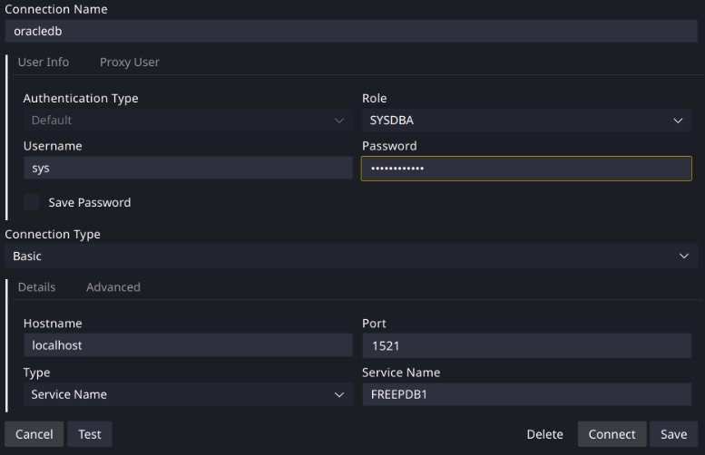

# Track 2: Analytics, PLSQL and Big Data

This track explores the following areas and is taught every Friday:

## Contents

### Data analytics

Introduction to techniques for analysing and interpreting complex datasets with R to extract valuable insights.

### PL/SQL programming

Gain practical experience with Oracle's procedural extension for SQL, used to write sophisticated database queries and procedures.

### Big data systems

Explore the architecture and technologies behind managing and processing massive datasets, including data warehouses, distributed storage, and parallel processing.

## Assessment

Assessment for this track includes:

- CW2: PLSQL Programming (30%)
  - TLDR: Write PL/SQL code to solve a given problem.

## Running Oracle Locally

USW recommend using Oracle's Live SQL platform for hands-on practice, or their own instance of an Oracle database. I didn't want to do this, so I set up a local Oracle database using a free Docker image.

### Prerequisites

- Docker or Podman installed on your machine.
- If using Podman, ensure you have it alias `docker` or replace `docker` commands with `podman`.

To run the container locally, use the following command:

### Pull the container image:

```bash
docker pull docker.io/gvenzl/oracle-free:23.6-slim-faststart
```

### Run the container:

```bash
docker run --name oracledb -d -p 1521:1521 \
  -e ORACLE_PASSWORD=testpassword \
  docker.io/gvenzl/oracle-free:23.6-slim-faststart
```

### Connect to the database:

#### Using SQL Developer (Recommended)

I'd recommend using the SQL Developer VSCode extension.

You can connect to the database using SQL Developer with the following connection details:

```plaintext
Authentication Type: Default
Role: SYSDBA
Username: sys
Password: testpassword

Hostname: localhost
Port: 1521
Type: Service Name
Service Name: FREEPDB1
```

See the below screenshot for reference:



#### Using SQL*Plus

You can exec into the container and use SQL*Plus:

```bash
docker exec -it oracledb bash
```

Then inside the container:

```bash
sqlplus sys/testpassword@//localhost:1521/XEPDB1 as sysdba
```

Once executed, you will be prompted for a username and password. Use the following credentials:

- Username: `system`
- Password: `testpassword`

From here, you can run SQL commands against the Oracle database.

### Stopping the container

To stop the container, use the following command:

```bash
docker stop oracledb
```